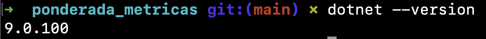
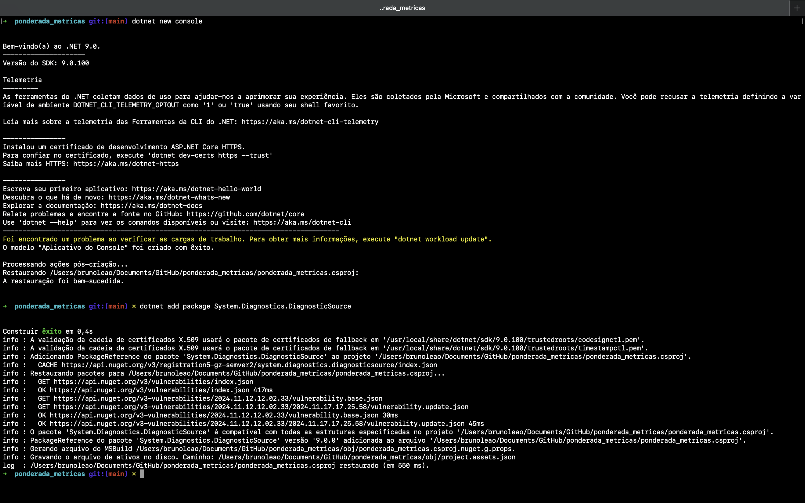
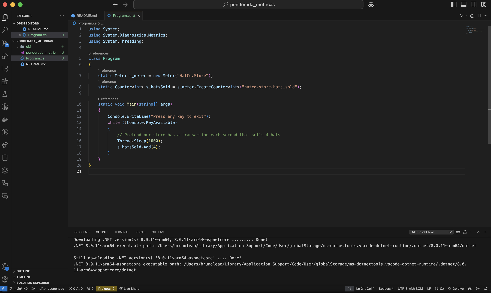
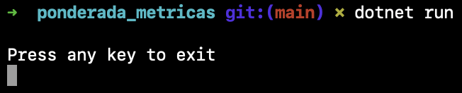
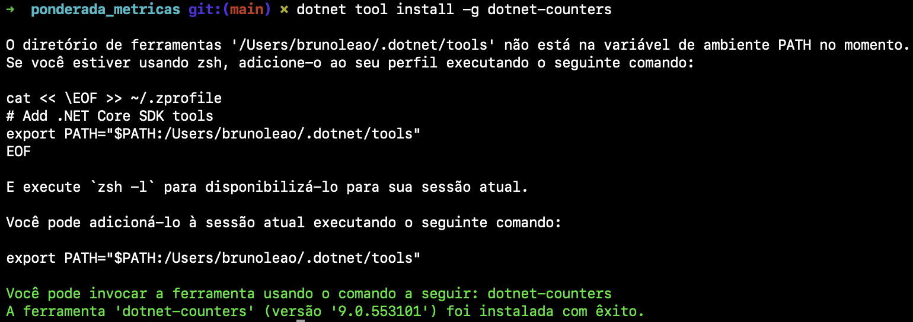
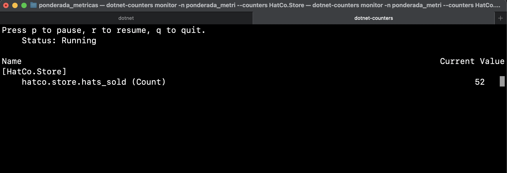

# Ponderada Métricas

Este projeto demonstra como criar e monitorar métricas personalizadas no .NET, utilizando a biblioteca `System.Diagnostics.Metrics` e a ferramenta `dotnet-counters`.

---

## **Passos Realizados**

1. **Configuração do Ambiente**
   - Verificação da versão instalada do SDK do .NET para garantir que é compatível com o projeto.
   - O comando utilizado foi:
     ```bash
     dotnet --version
     ```
   - A versão foi exibida corretamente no terminal.

    
   </img>

---

2. **Criação do Projeto**
   - Um projeto de console foi criado com o comando:
     ```bash
     dotnet new console
     ```
   - O pacote `System.Diagnostics.DiagnosticSource` foi adicionado ao projeto para suportar métricas.
     ```bash
     dotnet add package System.Diagnostics.DiagnosticSource
     ```
   - Esses passos configuraram o ambiente básico para a implementação das métricas.

    
   </img>

---

3. **Implementação do Código**
   - Foi implementado um contador de métricas (`Counter`) para registrar a quantidade de itens processados pela aplicação.
   - O código utiliza a classe `Meter` para criar o grupo de métricas e o `Counter` para acompanhar incrementos no total de itens vendidos.

   
   </img>

---

4. **Execução do Programa**
   - O programa foi executado utilizando o comando:
     ```bash
     dotnet run
     ```
   - Durante a execução, a aplicação simula a venda de 4 itens por segundo e exibe no console mensagens como "4 hats sold".

   
   </img>

---

5. **Monitoramento das Métricas**
   - Com o programa em execução, as métricas foram monitoradas utilizando a ferramenta `dotnet-counters`. Os comandos utilizados foram:
     - Listar os processos ativos:
       ```bash
       dotnet-counters ps
       ```
     - Monitorar métricas do processo ativo:
       ```bash
       dotnet-counters monitor -n ponderada_metricas --counters HatCo.Store
       ```
   - A saída do monitoramento exibiu as métricas do contador `HatCo.Store.hats_sold`, atualizando os valores em tempo real.

   
   - Processo ativo:
     </img>
   - Métricas monitoradas:
     </img>

---

## **Código Implementado**

Abaixo está o código completo implementado no arquivo `Program.cs`:

```csharp
using System;
using System.Diagnostics.Metrics;
using System.Threading;

class Program
{
    static Meter s_meter = new Meter("HatCo.Store");
    static Counter<int> s_hatsSold = s_meter.CreateCounter<int>("hatco.store.hats_sold");

    static void Main(string[] args)
    {
        Console.WriteLine("Press any key to exit");
        while (!Console.KeyAvailable)
        {
            // Simulando a venda de 4 itens por segundo
            Thread.Sleep(1000);
            s_hatsSold.Add(4);
            Console.WriteLine("4 hats sold");
        }
    }
}
```

---

## **Resultados do Monitoramento**

Durante o monitoramento com o `dotnet-counters`, os seguintes resultados foram observados:

- O contador `hatco.store.hats_sold` atualizava o número total de itens vendidos em tempo real.
- A ferramenta mostrou o aumento constante de vendas a cada segundo.

 
</img>

---

## **Conclusão**

Este projeto mostrou como criar métricas personalizadas no .NET e monitorá-las em tempo real usando ferramentas integradas. As métricas implementadas, como o contador `HatCo.Store.hats_sold`, podem ser utilizadas para análise de desempenho, geração de relatórios ou integração com ferramentas de observabilidade.

Essa abordagem permite uma visão detalhada do comportamento da aplicação, facilitando a identificação de gargalos e áreas de melhoria.

--- 
